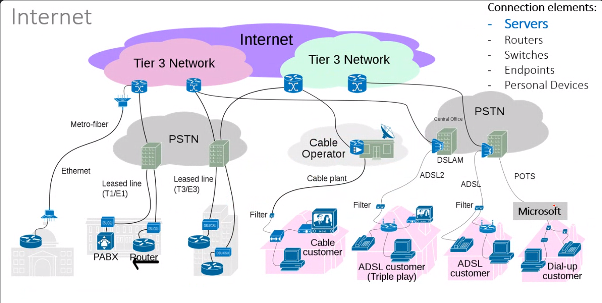

# Apuntes de Clase 

## 26 - 10 - 2024

Capa Física se encarga de toda la etapa de hardware, ajustes eléctricos, electrónicos, ecualización de energía.

Capa de Redes encargada de conectar y transmitir paquetes de datos, fungiendo como mediador entre capas. Puede percatarse de errores en la transmision de los datos.

Capa de Datos por lo general define a resumidas cunetas las transacciones quese pueden utilizar para un intercambio de datos entre partes. En la capa Física, Redes y Datos hablamos un poco mas de abstracción hacia hardware.

Capa de Aplicaciones refiere generalmente a softwares de interacción con todo el sistema y hardware.

Capa de Usuario es la encargada de mostrarse y transmitir información hacia el usuario final. La capa de Aplicaciones y Usuario hacen referencia al software mismo que se encargará de orquestar las capas de hardware.

## Server High Level Architecture

