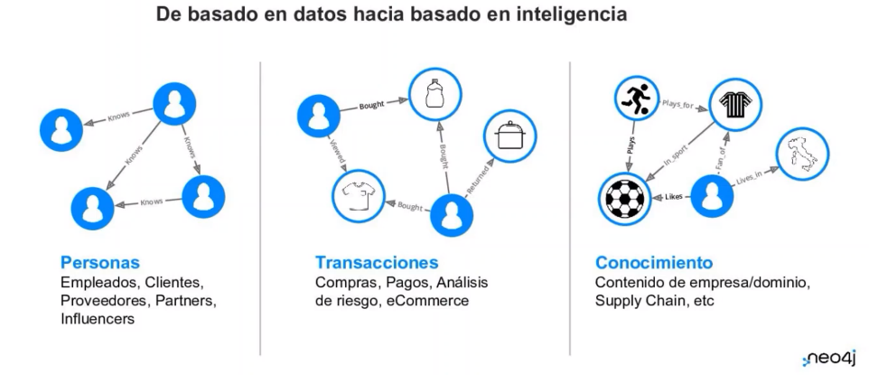
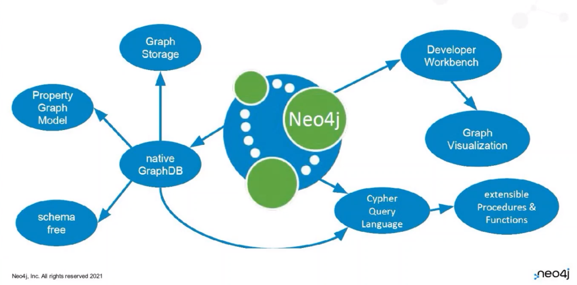
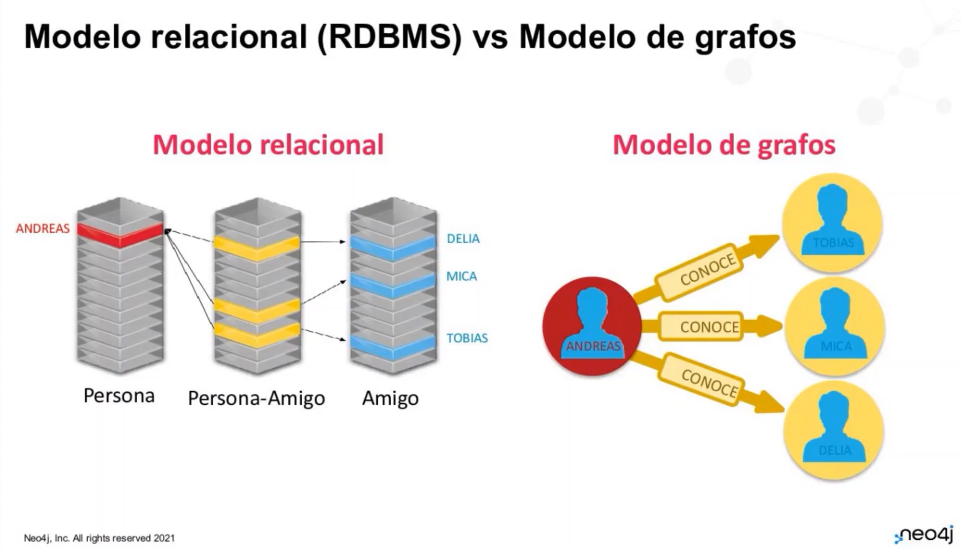
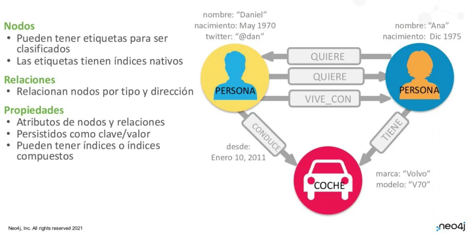
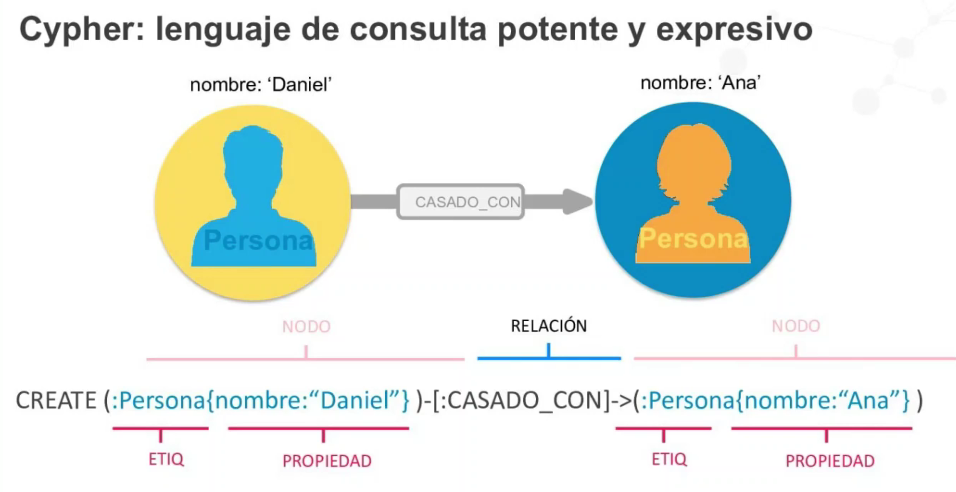
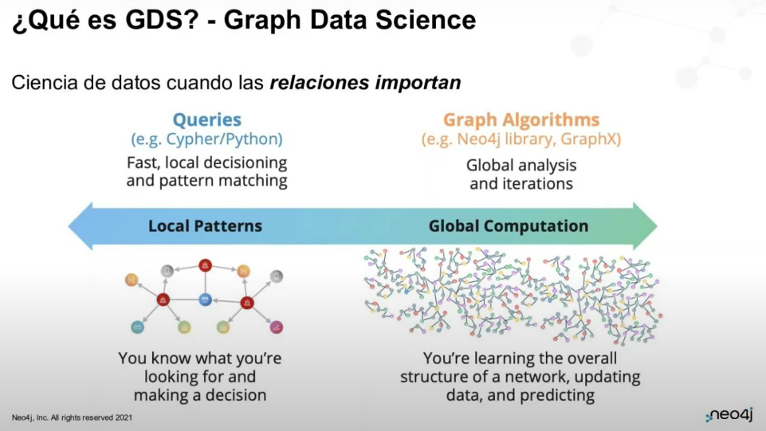
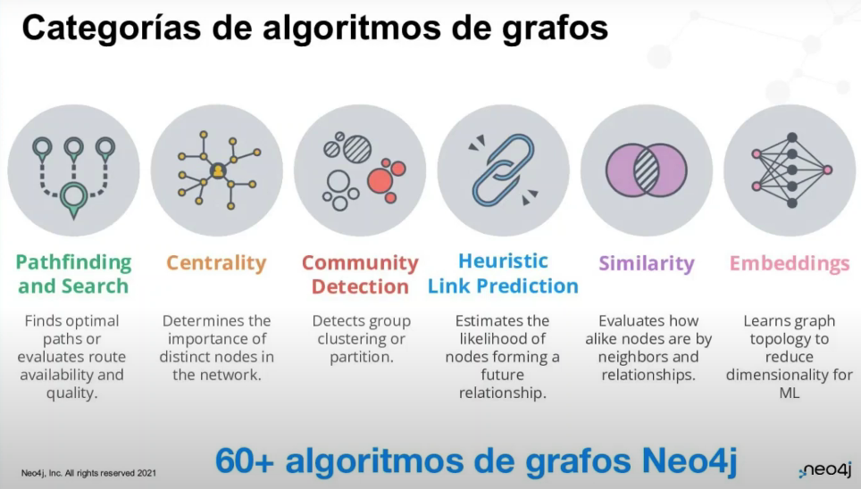

# Bases de Datos Basadas en Grafos neo4j
## Teoría de Grafos

Un grafo es una colección de objetos en la que cada uno tiene una serie de relaciones con otros objetos.

La tecnología de grafos representa relaciones de datos de una forma intuitiva.

Neo4j es una base de datos nativa, donde tenemos herramientas de desarrollo y herramientas de visualización.

El lenguaje utilizado es Cypher, es declarativo y es de tipo Java.

## Modelos Relacionales vs Modelos de Grafos

Con los modelos relacionales, las consultas se vuelven más costosas en el ámbito computacional mientras más grande sea la DB.

¿Qué es lo que utilizamos? En las bases de datos esto es lo que se coloca en caché:

En cada nodo obtener la relación y hacer match con los punteros dentro de la tabla de la base de datos.

El modelo se plantea de manera sencilla, ya que se le puede llamar "El modelo del pizarrón es nuestro modelo físico". Con lo cual, una vez dibujado el trazo y la manera de obtener los datos de un principio puede conllevar muy pocos cambios.

## El modelo de grafo de propiedades

### ¿Qué contienen?

- Nodos
    - Pueden tener etiquetas para clasificarse
    - Las etiquetas tienen índices nativos
- Relaciones
    - Relacionan nodos por tipo y dirección
- Propiedades
    - Atributos de nodos y relaciones
    - Persistidos como clave/valor
    - Pueden tener índices o índices compuestos

## ¿Qué es CYPHER?

Es un lenguaje de consulta potente y expresivo.

Las consultas se pueden crear de manera direccional o bidireccional utilizando las flechas de consulta hacia el lado donde exista o existan las relaciones.

## Graph Data Science

Es una ciencia de datos cuando las relaciones se importan.

Existen distintos tipos de algoritmos para los grafos:

## Teoría de Grafos

Un grafo es una colección de objetos en la que cada uno tiene una serie de relaciones con otros objetos.

La tecnología de grafos representa relaciones de datos de una forma intuitiva.

Neo4j es una base de datos nativa, donde tenemos herramientas de desarrollo y herramientas de visualización.

El lenguaje utilizado es Cypher, es declarativo y es de tipo Java.

## Modelos Relacionales vs Modelos de Grafos

Con los modelos relacionales, las consultas se vuelven más costosas en el ámbito computacional mientras más grande sea la DB.

¿Qué es lo que utilizamos? En las bases de datos esto es lo que se coloca en caché:

En cada nodo obtener la relación y hacer match con los punteros dentro de la tabla de la base de datos.

El modelo se plantea de manera sencilla, ya que se le puede llamar que "El modelo del pizarrón es nuestro modelo físico"
Con lo cual una vez dibujado el trazo y la manera de obtener los datos de un principio puede conllevar muy pocos cambios.

## El modelo de grafo de propiedades

### ¿Qué contienen?

- Nodos
    - Pueden tener etiquetas para clasificarse
    - Las etiquetas tienen indices nativos
- Relaciones
    - Relacionan nodos por tipo y direccion
- Propiedades
    - Atributos de nodos y relaciones
    - Persistidos como clave/valor
    - Pueden tener índices o índices compuestos

## ¿Qué es CYPHER?

Es un lenguaje de consulta potente y expresivo

Las consultas se pueden crear de manera direccional o bidireccional utilizando las flechas de consulta hacia el lado donde exista o existan las relaciones.

## Graph Data Science

Es una ciencia de datos cuando las relaciones se importan

Existen distitnos tipos de algoritmos para los grafos:

